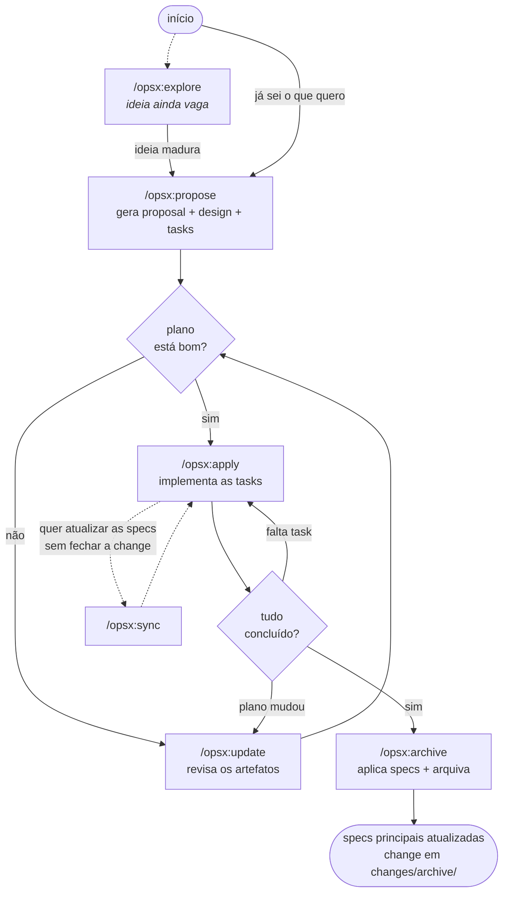

# OpenSpec — Guia de Comandos e Fluxo

Referência dos comandos do OpenSpec neste repositório: o que cada um faz,
quando usar e em que ordem. Versão do CLI: **1.6.0**. Schema configurado:
**`spec-driven`** (ver `openspec/config.yaml`).

O OpenSpec é um sistema de *spec-driven development*: antes de escrever código,
você registra **o quê / por quê** (proposta), **como** (design) e **os passos**
(tarefas). O agente implementa a partir desses artefatos, e no fim as decisões
viram especificações permanentes do projeto.

---

## 1. Como o repositório está organizado

```
openspec/
  config.yaml            # schema + contexto do projeto + regras por artefato
  changes/               # mudanças ativas (uma pasta por change)
    <nome-da-change>/
      proposal.md        # o quê e por quê
      design.md          # como
      tasks.md           # passos de implementação (checklist)
      specs/             # delta specs: o que muda nas specs principais
    archive/             # changes concluídas e arquivadas
  specs/                 # specs principais (estado atual do sistema)
```

Estado atual: `specs/` e `changes/` estão **vazios** — nenhuma change foi
proposta ainda.

Há duas camadas de comandos:

| Camada | O que é | Onde vive |
|---|---|---|
| **Slash commands** `/opsx:*` | Fluxo de trabalho conduzido pelo agente | `.claude/commands/opsx/` |
| **CLI** `openspec …` | Ferramenta de linha de comando que lê/escreve os arquivos | `PATH` do sistema |

Na prática você usa os **slash commands**; o CLI é o que eles chamam por baixo,
mas serve também para consulta manual.

---

## 2. Slash commands (`/opsx:*`) — o fluxo principal

Todos aceitam o nome da change como argumento. Se você omitir, o agente tenta
inferir do contexto da conversa; se houver ambiguidade, ele pergunta.

### `/opsx:explore [assunto]`
Modo "parceiro de pensamento". Investiga o código, discute alternativas,
esclarece requisitos. **Nunca implementa** — se você pedir código, ele lembra
que é preciso sair do modo explore e criar uma proposta. Pode criar artefatos
OpenSpec se você pedir (capturar pensamento ≠ implementar).

Use quando: a ideia ainda está vaga, ou você quer entender o impacto antes de
se comprometer.

### `/opsx:propose <descrição>`
Cria a change e gera **todos os artefatos de uma vez**: `proposal.md`,
`design.md` e `tasks.md`. É o ponto de entrada do fluxo formal.

Use quando: você já sabe o que quer construir.

### `/opsx:update [change]`
Revisa os artefatos de planejamento de uma change existente e mantém os três
coerentes entre si (mudou o design → as tasks acompanham). **Nunca edita
código.**

Use quando: o plano mudou no meio do caminho, ou uma decisão nova precisa ser
incorporada.

### `/opsx:apply [change]`
Implementa as tarefas do `tasks.md`, marcando cada uma conforme conclui. **É a
única etapa que escreve código.**

Use quando: o plano está aprovado e é hora de executar.

### `/opsx:sync [change]`
Mescla os *delta specs* da change nas specs principais (`openspec/specs/`) — sem
arquivar a change. O merge é feito pelo agente, que lê os deltas e edita as
specs de forma inteligente (ex.: adiciona um cenário sem duplicar o requisito
inteiro).

Use quando: você quer que as specs principais reflitam a mudança, mas a change
ainda continua ativa.

### `/opsx:archive [change]`
Finaliza a change: aplica as specs e move a pasta para
`openspec/changes/archive/`.

Use quando: a implementação está concluída e verificada.

---

## 3. Fluxo recomendado



Em uma linha:

```
explore (opcional) → propose → apply → archive
                        ↑         ↓
                     update    sync (opcional)
```

### Ciclo típico de uma sessão

```bash
# 1. Pensar (opcional)
/opsx:explore trocar o cache por um formato indexado

# 2. Propor
/opsx:propose adicionar flag --sem-rede ao run_pipeline

# 3. Conferir o que foi gerado
openspec show adicionar-flag-sem-rede
openspec status --change adicionar-flag-sem-rede

# 4. Ajustar o plano, se preciso
/opsx:update adicionar-flag-sem-rede

# 5. Implementar
/opsx:apply adicionar-flag-sem-rede

# 6. Validar e fechar
openspec validate adicionar-flag-sem-rede --strict
/opsx:archive adicionar-flag-sem-rede
```

---

## 4. CLI — comandos do dia a dia

Os que você mais usa para consultar o estado do projeto:

| Comando | Serve para |
|---|---|
| `openspec list` | Lista as changes ativas (`--specs` lista specs; `--sort name`; `--json`) |
| `openspec show <item>` | Mostra uma change ou spec (`--json`, `--deltas-only`, `--type change\|spec`) |
| `openspec status --change <nome>` | Progresso dos artefatos e das tasks daquela change |
| `openspec validate [item]` | Valida estrutura (`--all`, `--changes`, `--specs`, `--strict`) |
| `openspec view` | Dashboard interativo de specs e changes |
| `openspec doctor` | Saúde das relações no root resolvido (o que está órfão/inconsistente) |
| `openspec context` | Imprime o *briefing* de trabalho do root (`--json` para agentes) |

### Criação e instruções

| Comando | Serve para |
|---|---|
| `openspec new change <nome>` | Cria a pasta da change vazia (`--description`, `--goal`, `--schema`) |
| `openspec instructions <artefato> --change <nome>` | Emite as instruções enriquecidas para criar um artefato ou aplicar tasks — é o que os `/opsx:*` consomem |
| `openspec archive [change]` | Arquiva e atualiza as specs (`-y`, `--skip-specs` p/ mudanças de infra/doc, `--no-validate`) |

### Configuração e instalação

| Comando | Serve para |
|---|---|
| `openspec init [path]` | Inicializa o OpenSpec no projeto e configura os arquivos de instrução das ferramentas de IA (`--tools claude`) |
| `openspec update [path]` | Atualiza os arquivos de instrução após upgrade do CLI (`--force`) |
| `openspec config list \| get \| set \| unset \| reset \| edit \| path` | Configuração **global** (fora do repo) |
| `openspec config profile [preset]` | Escolhe o perfil de workflow |
| `openspec completion install [shell]` | Instala autocompletar no shell |

### Schemas (workflows) — experimental

| Comando | Serve para |
|---|---|
| `openspec schemas` | Lista os schemas disponíveis com descrição |
| `openspec schema which [nome]` | Mostra de onde o schema é resolvido |
| `openspec schema validate [nome]` | Valida a estrutura do schema e seus templates |
| `openspec schema fork <origem> [nome]` | Copia um schema para o projeto, para customizar |
| `openspec schema init <nome>` | Cria um schema local novo |
| `openspec templates --schema <nome>` | Mostra os caminhos de template de cada artefato |

Este repositório usa o `spec-driven` padrão — só mexa aqui se quiser um fluxo
próprio (ex.: adicionar um artefato "protocolo experimental" às changes).

### Stores e worksets — provavelmente não necessários aqui

**Store** é um repositório OpenSpec *standalone* registrado na máquina, usado
quando as specs vivem fora do repo de código. Não é o caso deste projeto: as
specs estão em `openspec/` dentro do próprio repo, então **você nunca precisa da
flag `--store`**.

| Comando | Serve para |
|---|---|
| `openspec store setup \| register \| unregister \| remove \| list \| doctor` | Gerencia esses repositórios de specs externos |
| `openspec workset create \| list \| open \| remove` | Compõe "visões de trabalho" locais com um conjunto de pastas |

### Outros

| Comando | Serve para |
|---|---|
| `openspec feedback <mensagem>` | Envia feedback sobre o OpenSpec (`--body`) |
| `openspec --version` / `--help` | Versão e ajuda; `openspec help <comando>` para ajuda de um comando |

---

## 5. Convenções deste projeto

O `openspec/config.yaml` já carrega o contexto do TCC (stack, arquitetura das 5
fases, invariantes do experimento). Consequências práticas ao usar os comandos:

- **Artefatos em português.** Proposta, design e tasks seguem a mesma língua do
  resto do repo.
- **Toda proposta declara** a qual pergunta de pesquisa atende (ou que é
  infraestrutura), traz uma seção "Não-objetivos" e avisa se invalida resultados
  já gerados.
- **Todo design aponta** quais fases (0–5) e quais arquivos de `src/`,
  `scripts/` e `docs/` são tocados, além do impacto em cota de LLM.
- **Toda task** cabe em ~2 h e é verificável por um comando concreto; se a
  interface de uso mudar, há uma task para atualizar `docs/` e `README.md`.
- Mudanças que só mexem em infraestrutura, tooling ou documentação podem ser
  arquivadas com `openspec archive <nome> --skip-specs`.

Ver também: [`PIPELINE.md`](PIPELINE.md) (arquitetura das 5 fases) e
[`SCRIPTS.md`](SCRIPTS.md) (referência dos scripts).
